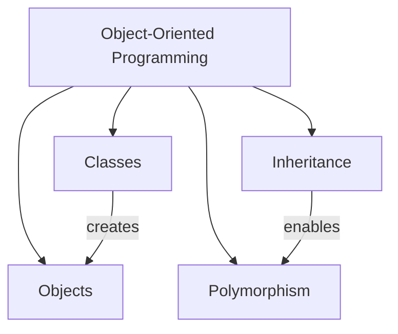
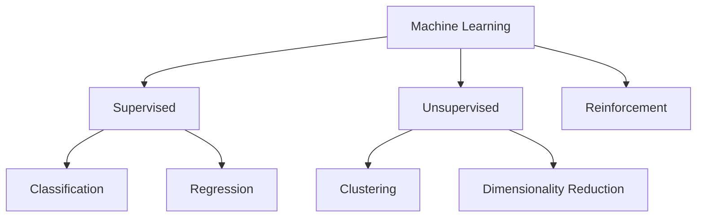
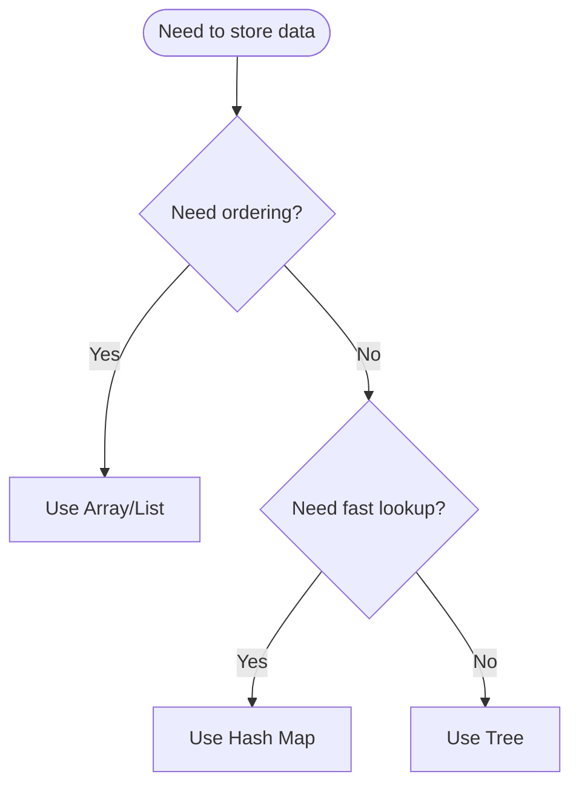
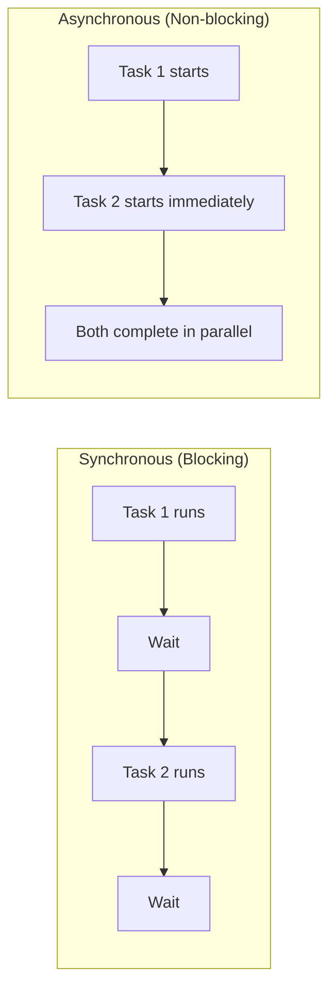
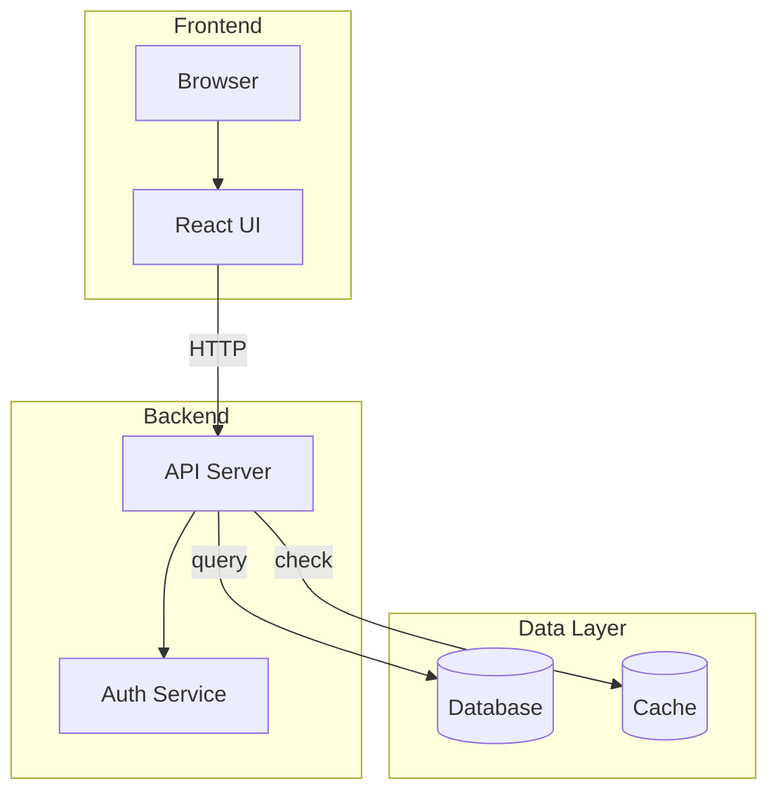
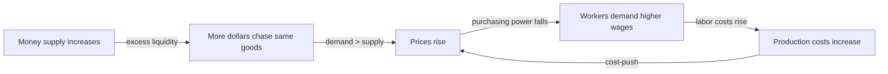

# Visual Patterns Reference

This document defines the visual types available for course diagrams and when to use each. Each pattern includes selection criteria, layout guidance, and a Mermaid example.

---

## Concept Map

**Use when**: The topic has 5+ interconnected ideas that don't follow a strict hierarchy or sequence.

**Mermaid type**: `graph TD` or `graph LR`

**Layout**: Radial or network. Place the central concept at the top/left, with related concepts branching out.

**Best for**: Showing how ideas relate to each other. Ideal for topic overviews, vocabulary webs, and "big picture" diagrams.

**Example**:

---

## Hierarchy Diagram

**Use when**: The topic has categories, types, or levels. Information flows from general to specific.

**Mermaid type**: `graph TD`

**Best for**: Taxonomies, classification systems, abstraction layers, organizational structures.

**Example**:

---

## Flowchart

**Use when**: The topic involves a process, decision-making, or sequential steps. Order matters.

**Mermaid type**: `flowchart TD` (use `{}` for decision diamonds)

**Best for**: Algorithms, workflows, decision trees, troubleshooting guides, step-by-step procedures.

**Example**:

---

## Before/After Comparison

**Use when**: The topic involves transformation or contrasting approaches.

**Mermaid type**: `graph LR` with parallel branches

**Best for**: Paradigm shifts, improvement patterns, misconception correction.

**Example**:

---

## System Diagram

**Use when**: The topic has interacting components or modules. Focus is on architecture and data flow.

**Mermaid type**: `graph TD` or `graph LR` with `subgraph` blocks

**Best for**: Architectures, ecosystems, multi-part systems, pipeline designs.

**Example**:

---

## Causal Chain

**Use when**: The topic has cause-effect relationships. You want to show "why" sequences or chain reactions.

**Mermaid type**: `graph LR`

**Best for**: Explaining "why" sequences, domino effects, feedback loops, root cause analysis.

**Example**:

---

## Selection Guide

| Learner Level | Recommended Visual Types | Max Nodes |
|---|---|---|
| Beginner | Concept Map (simple), Before/After | 5 |
| Novice | Concept Map, Hierarchy, Before/After | 7 |
| Intermediate | Flowchart, System Diagram, Concept Map | 10 |
| Advanced | System Diagram, Causal Chain, Flowchart | 14 |
| Expert | Causal Chain (with feedback), System Diagram (multi-layer) | 20 |

## Mermaid Syntax Reminders

- Use ` ` for line breaks inside node labels (NOT `\n`)
- Quote node text with special characters: `A["Loss = f(x)"]`
- Decision diamonds use `{}`: `D{Is error low?}`
- Subgraphs for grouping: `subgraph Name ... end`
- Edge labels: `A -->|label text| B`
- Do NOT use `style` or `classDef` — keep diagrams clean
